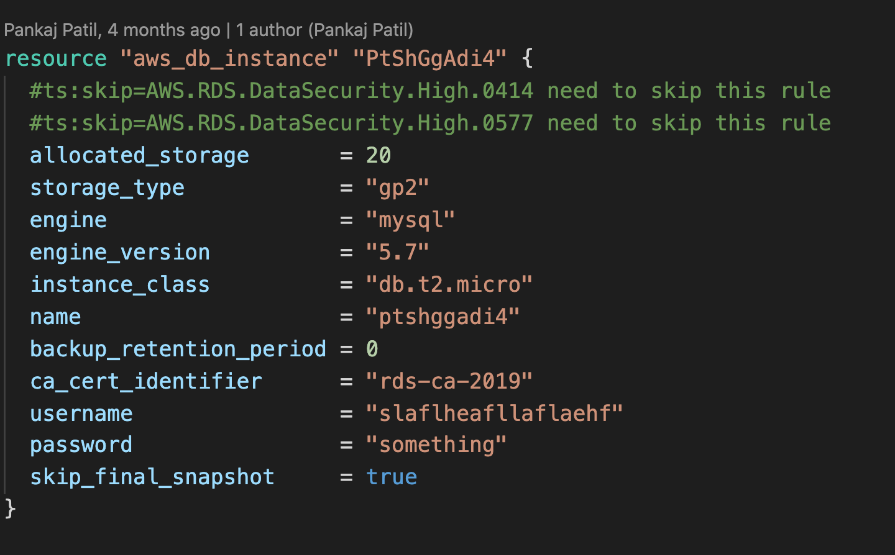
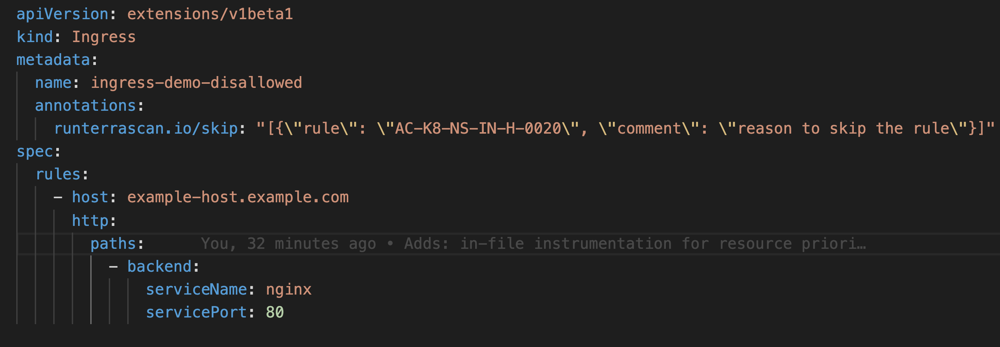

[](https://github.com/tenable/terrascan/releases/latest)
[](https://github.com/tenable/terrascan/blob/master/LICENSE)
[](https://github.com/tenable/terrascan/pulls)

[](https://sonarcloud.io/summary/new_code?id=tenable_terrascan)
[](https://repology.org/project/terrascan/versions)
[](https://codecov.io/gh/tenable/terrascan)
[](https://runterrascan.io/)
[](code_of_conduct.md)


## Introduction

Terrascan is a static code analyzer for Infrastructure as Code. Terrascan allows you to:

- Seamlessly scan infrastructure as code for misconfigurations.
- Monitor provisioned cloud infrastructure for configuration changes that introduce posture drift, and enables reverting to a secure posture.
- Detect security vulnerabilities and compliance violations.
- Mitigate risks before provisioning cloud native infrastructure.
- Offers flexibility to run locally or integrate with your CI\CD.


### Resources
* To try Terrascan in your browser, see the Terrascan Sandbox https://www.tenable.com/terrascan

* To learn more about Terrascan's features and capabilities, see the documentation portal: https://runterrascan.io

<p align="center">
    Join Tenable community 👇
<br/>
<a href="https://discord.gg/ScUPMzyG3n">
    
</a>
</p>


## Key features
* 500+ Policies for security best practices
* Scanning of [Terraform](https://runterrascan.io/docs/usage/command_line_mode/#scanning-current-directory-containing-terraform-files-for-aws-resources) (HCL2)
* Scanning of AWS CloudFormation Templates (CFT)
* * Scanning of Azure Resource Manager (ARM)
* Scanning of [Kubernetes](https://runterrascan.io/docs/usage/command_line_mode/#scanning-for-a-specific-iac-provider) (JSON/YAML), [Helm](https://runterrascan.io/docs/usage/command_line_mode/#scanning-a-helm-chart) v3, and [Kustomize](https://runterrascan.io/docs/usage/command_line_mode/#scanning-a-kustomize-chart)
* Scanning of [Dockerfiles](https://runterrascan.io/docs/usage/command_line_mode/#scanning-a-dockerfile)
* Support for [AWS](https://runterrascan.io/docs/policies/aws/), [Azure](https://runterrascan.io/docs/policies/azure/), [GCP](https://runterrascan.io/docs/policies/gcp/), [Kubernetes](https://runterrascan.io/docs/policies/k8s/), [Dockerfile](https://runterrascan.io/docs/policies/docker/), and [GitHub](https://runterrascan.io/docs/policies/github/)
* Integrates with docker image vulnerability scanning for AWS, Azure, GCP, Harbor container registries.

## Quick Start

1. [Install](#install)
2. [Scan](#scan)
3. [Integrate](#integrate)

### Step 1: Install
Terrascan supports multiple ways to install and is also available as a Docker image.
See Terrascan's [releases](https://github.com/tenable/terrascan/releases) page for the latest version of builds in all supported platforms. Select the correct binary for your platform.

#### Install as a native executable

```sh
$ curl -L "$(curl -s https://api.github.com/repos/tenable/terrascan/releases/latest | grep -o -E "https://.+?_Darwin_x86_64.tar.gz")" > terrascan.tar.gz
$ tar -xf terrascan.tar.gz terrascan && rm terrascan.tar.gz
$ install terrascan /usr/local/bin && rm terrascan
$ terrascan
```

#### Install on ArchLinux / Manjaro via `AUR`

ArchLinux and Manjaro users can install by:

```
yay -S terrascan
```

#### Install via `brew`

[Homebrew](https://brew.sh/) users can install by:

```sh
$ brew install terrascan
```

#### Docker image

Terrascan is also available as a Docker image and can be used as follows

```sh
$ docker run tenable/terrascan
```
Refer to [documentation](https://runterrascan.io/docs/getting-started/) for information.

### Step 2: Scan
To scan your code for security issues you can run the following (defaults to scanning Terraform).

```sh
$ terrascan scan
```
**Note**: Terrascan will exit with an error code if any errors or violations are found during a scan.

#### List of possible Exit Codes
| Scenario      | Exit Code |
| ----------- | ----------- |
| scan summary has errors and violations | 5 |
| scan summary has errors but no violations | 4 |
| scan summary has violations but no errors | 3 |
| scan summary has no violations or errors | 0 |
| scan command errors out due to invalid inputs | 1 |
### Step 3: Integrate with CI\CD

Terrascan can be integrated into CI/CD pipelines to enforce security best practices.
Please refer to our [documentation to integrate with your pipeline](https://runterrascan.io/docs/integrations/).

## Terrascan Commands
You can use the `terrascan` command with the following options:

```sh
$ terrascan
Terrascan

Usage:
  terrascan [command]

Available Commands:
  help        Help about any command
  init        Initialize Terrascan
  scan        Detect compliance and security violations across Infrastructure as Code.
  server      Run Terrascan as an API server
  version     Terrascan version

Flags:
  -c, --config-path string   config file path
  -h, --help                 help for terrascan
  -l, --log-level string     log level (debug, info, warn, error, panic, fatal) (default "info")
  -x, --log-type string      log output type (console, json) (default "console")
  -o, --output string        output type (human, json, yaml, xml) (default "human")

Use "terrascan [command] --help" for more information about a command.
```

## Policies
Terrascan policies are written using the [Rego policy language](https://www.openpolicyagent.org/docs/latest/policy-language/). Every rego includes a JSON "rule" file which defines metadata for the policy.
By default, Terrascan downloads policies from Terrascan repositories while scanning for the first time. However, if you want to download the latest policies, you need to run the Initialization process. See [Usage](https://runterrascan.io/docs/usage/command_line_mode/) for information about the Initialization process.

Note: The scan command will implicitly run the initialization process if there are no policies found.

## Docker Image Vulnerabilities
You can use the `--find-vuln` flag to collect vulnerabilities as reported in its registry as part of Terrascan's output. Currently Terrascan supports Elastic Container Registry (ECR), Azure Container Registry, Google Container Registry, and Google Artifact Registry.

The `--find-vuln` flag can be used when scanning IaC files as follows:

```
$ terrascan scan -i <IaC provider> --find-vuln
```

For more information and explanation of how to setup your environment to authenticate with the registrie's APIs see the [usage](https://runterrascan.io/docs/usage/command_line_mode/) documentation.

## Customizing scans

By default, Terrascan scans your entire configuration against all policies. However, Terrascan supports granular configuration of policies and resources.

Read more about [in-file instrumentation](https://runterrascan.io/docs/usage/in-file_instrumentation/) and [the config file](https://runterrascan.io/docs/usage/config_options/) on our documentation site.

For now, some quick tips:

- [Exclude a particular policy for a specific resource.](#How_to_exclude_a_policy_while_scanning_a_resource)
- [Manually configure policies to be suppressed or applied globally from a scan across all resources or, for just a particular resource.](#_How_to_include_or_exclude_specific_policies_or_resources_from_being_scanned)

### How to exclude a policy while scanning a resource

You can configure Terrascan to skip a particular policy (rule) while scanning a resource. Follow these steps depending on your platform:

#### Terraform
Use Terraform scripts to configure Terrascan to skip rules by inserting a comment with the phrase `"ts:skip=<RULENAME><SKIP_REASON>"`. The comment should be included inside the resource as shown in the example below.



#### Kubernetes
In Kubernetes yamls, you can configure Terrascan to skip policies by adding an annotation as seen in the snippet below.



### How to include or exclude specific policies or resources from being scanned

Use the Terrascan config file to manually select the policies which should be included or excluded from the entire scan. This is suitable for edge use cases.
Use the "in-file" suppression option to specify resources that should be excluded from being tested against selected policies. This ensures that the policies are skipped only for particular resources, rather than all of the resources.


### Sample scan output

Terrascan's default output is a list of violations present in the scanned IaC. A sample output:


## Building Terrascan
Terrascan can be built locally. This is helpful if you want to be on the latest version or when developing Terrascan. [gcc](https://gcc.gnu.org/install/) and [Go](https://go.dev/doc/install) 1.19 or above are required.

```sh
$ git clone git@github.com:tenable/terrascan.git
$ cd terrascan
$ make build
$ ./bin/terrascan
```

### To build your own docker, refer to this example (Alpine Linux):
```
FROM golang:alpine AS build-env

RUN apk add --update git

RUN git clone https://github.com/tenable/terrascan && cd terrascan \
  && CGO_ENABLED=0 GO111MODULE=on go build -o /go/bin/terrascan cmd/terrascan/main.go

```

## Developing Terrascan
To learn more about developing and contributing to Terrascan, refer to the [contributing guide](CONTRIBUTING.md).

## Code of Conduct
We believe having an open and inclusive community benefits all of us. Please note that this project is released with a [Contributor Code of Conduct](code_of_conduct.md). By participating in this project you agree to abide by its terms.

## License

Terrascan is licensed under the [Apache 2.0 License](LICENSE).

### Stargazers

[](https://github.com/tenable/terrascan/stargazers)

### Forkers

[](https://github.com/tenable/terrascan/network/members)


