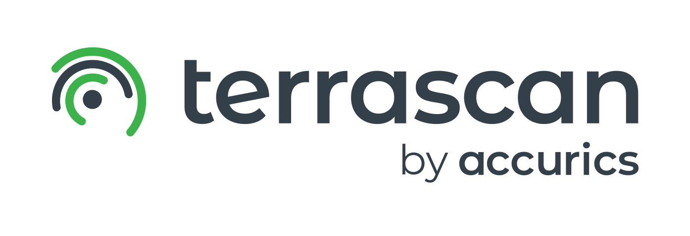

# Terrascan Documentation

Terrascan documentation is composed of the following major sections:

* [Getting Started](getting-started.md): Tutorial on how to install and run Terrascan for the first time.
* [Usage](usage/usage.md): Read in depth about the different configurations Terrascan supports. 
* [Integrations](integrations/overview.md): A growing list of guides on integrating Terrascan with different tools in the software development lifecycle.
* [Architecture](architecture.md): Understand the pluggable architecture powering Terrascan.
* [Policies](policies.md): Read more about how to write custom policies, and review parts of the policy pack included in Terrascan by default.

