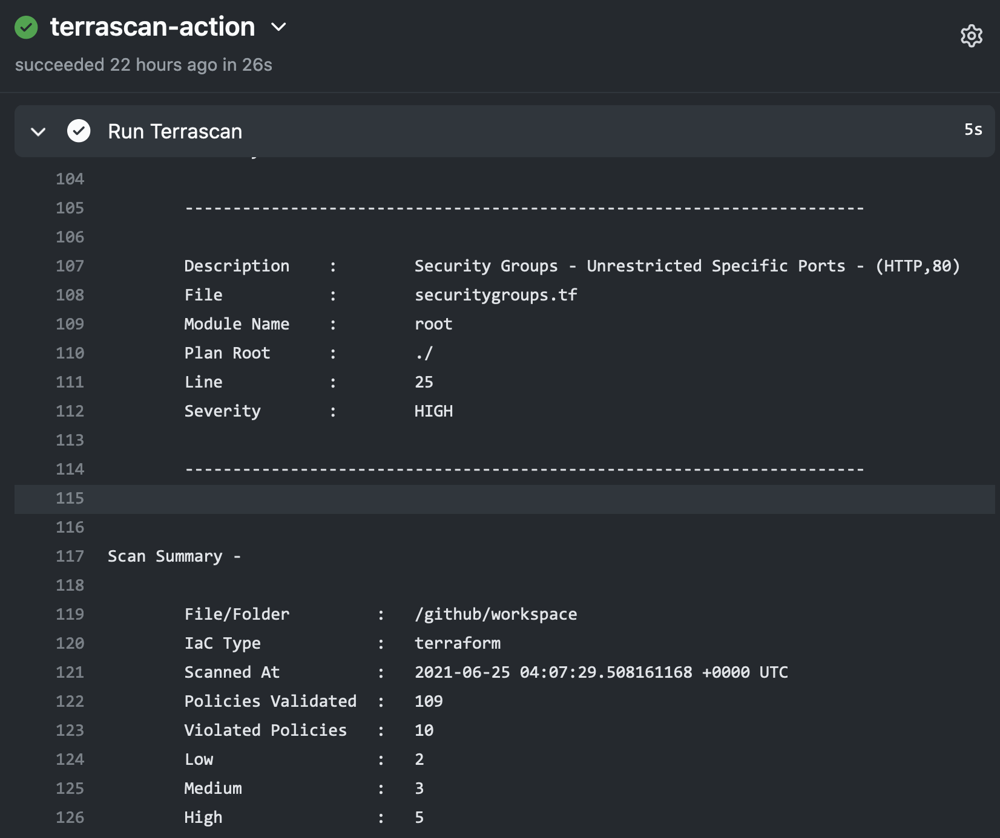
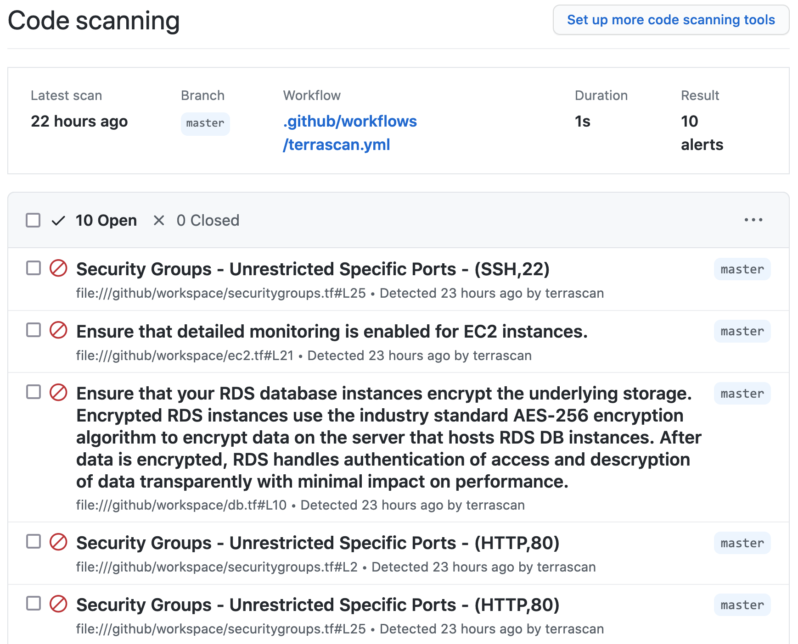
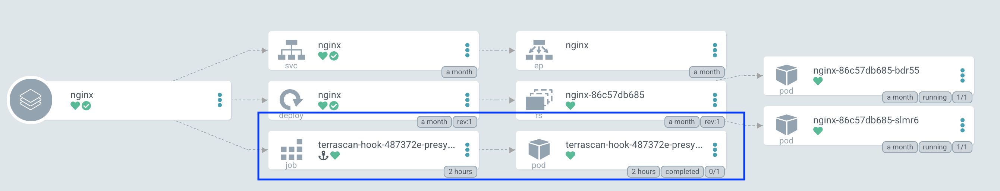
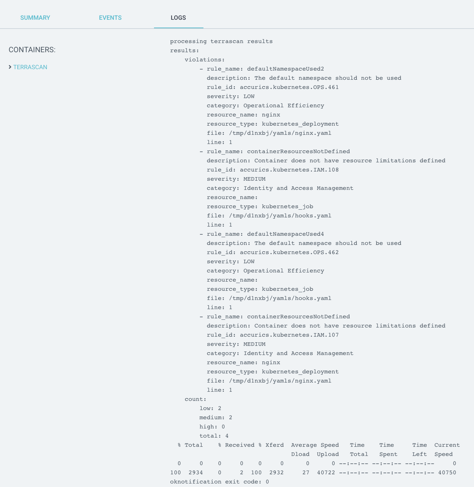

# Integrating Terrascan into CI/CD

Terrascan can be integrated into CI/CD pipelines to enforce security best practices as codified in the OPA rego policies included as part of Terrascan or any custom policies. This section contains examples on how to configure Terrascan in popular CI/CD tooling.

## GitHub Action

The [Terrascan GitHub Action](https://github.com/marketplace/actions/terrascan-iac-scanner) can be used as part of GitHub workflows to scan your repository for IaC issues as part of code pushes or pull requests.



Using Terrascan's SARIF output, the action can include issues found during the scan within [GitHub's code scanning](https://docs.github.com/en/rest/reference/code-scanning) results for the repository.




 Below is an example workflow configuration where the action is configured to scan a repository including Terraform v14+ HCL files for AWS resources and the SARIF output of the scan is uploaded to GitHub code scanning.


 ``` YAML
 
on: [push]

jobs:
  terrascan_job:
    runs-on: ubuntu-latest
    name: terrascan-action
    steps:
    - name: Checkout repository
      uses: actions/checkout@v2
    - name: Run Terrascan
      id: terrascan
      uses: accurics/terrascan-action@main
      with:
        iac_type: 'terraform'
        iac_version: 'v14'
        policy_type: 'aws'
        only_warn: true
        sarif_upload: true
        #non_recursive:
        #iac_dir:
        #policy_path:
        #skip_rules:
        #config_path:
    - name: Upload SARIF file
      uses: github/codeql-action/upload-sarif@v1
      with:
        sarif_file: terrascan.sarif
```


A detailed explanation of the action's input variables is available in the [terrascan-action](https://github.com/accurics/terrascan-action/) repository.

## GitLab CI

[GitLab CI](https://docs.gitlab.com/ee/ci/README.html) can use [Docker images](https://docs.gitlab.com/ee/ci/docker/using_docker_images.html) as part of a pipeline. We can take advantage of this functionality and use Terrascan's docker image as part of your [pipeline](https://docs.gitlab.com/ee/ci/pipelines/) to scan infrastructure as code.

To do this you can update your .gitlab-ci.yml file to use the "accurics/terrascan:latest" image with the ["bin/sh", "-c"] entrypoint. Terrascan can be found on "/go/bin" in the image and you can use any [Terrascan command line options](http://ubusvr:8000/getting-started/usage/#terrascan-commands) according to your needs. Here's an example .gitlab-ci.yml file:

``` YAML
stages:
  - scan

terrascan:
  image:
    name: accurics/terrascan:latest
    entrypoint: ["/bin/sh", "-c"]
  stage: scan
  script:
    - /go/bin/terrascan scan .
```


## Argo CD Application PreSync Hooks


Terrascan can be configured as an Argo CD job during the application sync process using [resource hooks](https://argoproj.github.io/argo-cd/user-guide/resource_hooks). The PreSync resource hook is the best way to evaluate the kubernetes deployment configuration and report any violations.




Adding the Terrascan job consists of two steps:

1. Creating a container which runs Terrascan
2. Configuring a PreSync hook which uses that container

We'll address the PreSync hook first.

### Step 1: Configure PreSync resource hook

The following example hooks yaml is mostly ready to be added to an existing kubernetes configuration.  Just make sure the secrets volume is relevant, specify your new Terrascan container image, and make sure the embedded script scans your repo and sends notifications to your Slack webhook endpoint.


``` YAML
apiVersion: batch/v1
kind: Job
metadata:
  generateName: terrascan-hook-
  annotations:
    argocd.argoproj.io/hook: PreSync
spec:
  ttlSecondsAfterFinished: 3600
  template:
    spec:
      volumes:
      - name: secret-volume
        secret:
          secretName: ssh-key-secret
      containers:
      - name: terrascan-argocd
        image: "<your container namespace>/<your container build from step #2 below>:<hash>"
        command: ["/bin/ash", "-c"]
        args:
        - >
          cp /etc/secret-volume/ssh-privatekey /home/terrascan/.ssh/id_rsa &&
          chmod 400 /home/terrascan/.ssh/id_rsa &&
          /go/bin/terrascan scan -r git -u <git URL to scan> -i k8s -t k8s | /home/terrascan/bin/notify_slack.sh webhook-tests argo-cd https://hooks.slack.com/services/TXXXXXXXX/XXXXXXXXXXX/0XXXXXXXXXXXXXXXXXX
        volumeMounts:
          - name: secret-volume
            readOnly: true
            mountPath: "/etc/secret-volume"
      restartPolicy: Never
  backoffLimit: 1
```

As shown, the PreSync requires access to the repository where IaC is stored, using the same branch (default) as the Argo CD application pipeline.

For non-public repositories, the private key needs to be added as a kubernetes secret.

``` CONSOLE
  kubectl create secret generic ssh-key-secret \
    --from-file=ssh-privatekey=/path/to/.ssh/id_rsa \
    --from-file=ssh-publickey=/path/to/.ssh/id_rsa.pub
```

Configuring the job to delete only after the specified time see `ttlSecondsAfterFinished` will allow users to check for violations in the User Interface, the alternative is through **notifications**.



### Step 2: Create Terrascan container

The container which runs Terrascan can be built using the following files: known_hosts, notify_slack.sh, Dockerfile.

#### known_hosts

The `known_hosts` file ensures that the container will be able to clone your project's git repository in order to scan it.  Hashes for the most common public repository hosts are included here, and you may add hashes for any private hosts which you need to access in order to clone your project.

```
# known_hosts
github.com,192.30.255.113 ssh-rsa AAAAB3NzaC1yc2EAAAABIwAAAQEAq2A7hRGmdnm9tUDbO9IDSwBK6TbQa+PXYPCPy6rbTrTtw7PHkccKrpp0yVhp5HdEIcKr6pLlVDBfOLX9QUsyCOV0wzfjIJNlGEYsdlLJizHhbn2mUjvSAHQqZETYP81eFzLQNnPHt4EVVUh7VfDESU84KezmD5QlWpXLmvU31/yMf+Se8xhHTvKSCZIFImWwoG6mbUoWf9nzpIoaSjB+weqqUUmpaaasXVal72J+UX2B+2RPW3RcT0eOzQgqlJL3RKrTJvdsjE3JEAvGq3lGHSZXy28G3skua2SmVi/w4yCE6gbODqnTWlg7+wC604ydGXA8VJiS5ap43JXiUFFAaQ==
bitbucket.org,104.192.141.1 ssh-rsa AAAAB3NzaC1yc2EAAAABIwAAAQEAubiN81eDcafrgMeLzaFPsw2kNvEcqTKl/VqLat/MaB33pZy0y3rJZtnqwR2qOOvbwKZYKiEO1O6VqNEBxKvJJelCq0dTXWT5pbO2gDXC6h6QDXCaHo6pOHGPUy+YBaGQRGuSusMEASYiWunYN0vCAI8QaXnWMXNMdFP3jHAJH0eDsoiGnLPBlBp4TNm6rYI74nMzgz3B9IikW4WVK+dc8KZJZWYjAuORU3jc1c/NPskD2ASinf8v3xnfXeukU0sJ5N6m5E8VLjObPEO+mN2t/FZTMZLiFqPWc/ALSqnMnnhwrNi2rbfg/rd/IpL8Le3pSBne8+seeFVBoGqzHM9yXw==
gitlab.com,172.65.251.78 ecdsa-sha2-nistp256 AAAAE2VjZHNhLXNoYTItbmlzdHAyNTYAAAAIbmlzdHAyNTYAAABBBFSMqzJeV9rUzU4kWitGjeR4PWSa29SPqJ1fVkhtj3Hw9xjLVXVYrU9QlYWrOLXBpQ6KWjbjTDTdDkoohFzgbEY=
```

#### notify_slack.sh

The `notify_slack.sh` script is used to send a Slack notification after the scan completes.  This example expects the channel name, username, and webhook URL to be passed as command line arguments from the PreSync hook which invokes this container.  You may modify this script if you wish to send notifications in a different way.

``` SH
#!/bin/ash
# notify_slack.sh

function send_slack_notificaton {
  channel=$1
  username=$2
  slack_hook=$3

  curl -X POST --data-urlencode payload="{\"channel\": \"#${channel}\", \"username\": \"${username}\", \"text\": \" \`\`\` $(cat results.out) \`\`\` \", \"icon_emoji\": \":ghost:\"}" ${slack_hook}
}

if [ -p /dev/stdin ]; then
  echo "processing terrascan results"
  while IFS= read line; do
          echo "${line}" | tr '\\"' ' ' >> results.out
  done

  cat results.out

  send_slack_notificaton $1 $2 $3

  echo "notification exit code: $?"
else
  echo "no response skipping"
fi
```

#### Dockerfile

The `Dockerfile` is, of course, used to build the container.  In this case, we start with the official Terrascan image and we add in the above files to ensure we can access the repository and send notifications.

``` SH
# Dockerfile
  FROM accurics/terrascan:929e377

  ENTRYPOINT []

  USER root

  RUN apk add --no-cache openssh curl

  WORKDIR /home/terrascan

  RUN mkdir -p .ssh && mkdir -p bin

  COPY known_hosts .ssh

  COPY notify_slack.sh bin/

  RUN chown -R terrascan:terrascan .ssh && \
      chown -R terrascan:terrascan bin && \
      chmod 400 .ssh/known_hosts && \
      chmod u+x bin/notify_slack.sh

  USER terrascan

  CMD ["ash"]
```

Once you've built the image and pushed to your container registry, you can add the PreSync hook which will automatically run Terrascan during the application sync process.
